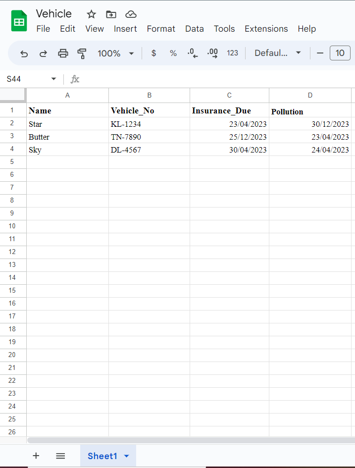
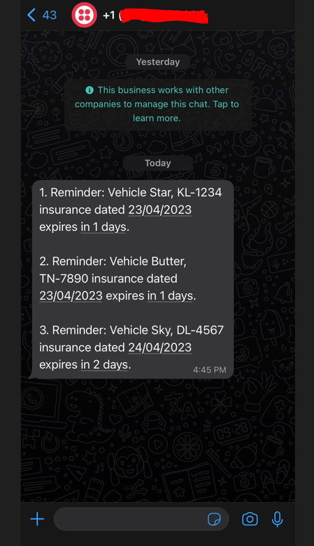

# Smart Reminder System using Python and Twilio

## Overview
The Smart Reminder System is a Python program that helps you, in this case keep track of your vehicle's important dates such as insurance and pollution expiry. It uses a Google Sheet as a database to store the vehicle details and other important dates and sends reminders through WhatsApp using Twilio API. You can easily modify the program to use other messaging platforms such as Telegram or SMS.

## Prerequisites
Before running the program, you need to have the following:
- A Google account
- A Google Sheet with the following columns: Name, Vehicle_No, Insurance_Due, Pollution. You can add more columns if you need to store additional information.
- A Google Service Account to access the Google Sheet API.
- A Twilio account with a WhatsApp sandbox to send messages. You need to get your account_sid and auth_token from the Twilio console.

## Installation
1. Clone this repository to your local machine.
2. Install the required packages by running `pip install -r requirements.txt`.
3. Place the JSON file containing your Google Service Account credentials in the root directory of the project. You can rename the file to `credentials.json` or use a different name and update the code accordingly.
4. Update the `config.py` file with your Twilio account details and other configuration options.
5. Inside the main.py you can run the smart_reminder function with all the necessary parameters to run the program.

## Usage
1. Add your vehicle details to the Google Sheet with the correct column headers: Name, Vehicle_No, Insurance_Due, Pollution. You can add more rows as needed.
2. Run the program to check for any upcoming deadlines. The program will send reminders for any deadlines that are within 7 days.
3. Receive the reminders on your WhatsApp number and take necessary actions.

## Customization
You can customize the program to suit your needs by modifying the following:
- The Google Sheet columns and row data.
- The date format used in the Google Sheet.
- The messaging platform and API used to send reminders.
- The reminder threshold (default is 7 days).

## Next Steps
This project is the first phase. In the next phase, we plan to incorporate a feature to automatically retrieve vehicle and other bills through government public APIs and store them in a structured format of our choice, which can be further enhanced using our code. We also plan to develop a UI so that customers can easily submit their bills and receive reminders when they're due.

## License
This project is licensed under the MIT License - see the `LICENSE` file for details.

## Acknowledgments
- `gspread` - Google Sheets Python API.
- Twilio API - WhatsApp messaging API.
- Python datetime - Date and time manipulation library.
